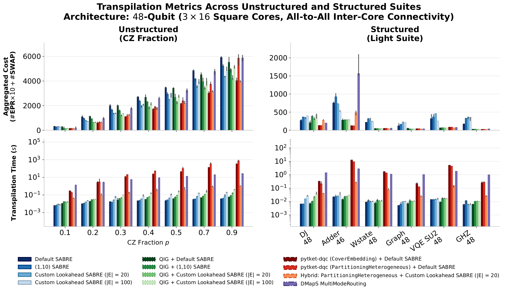
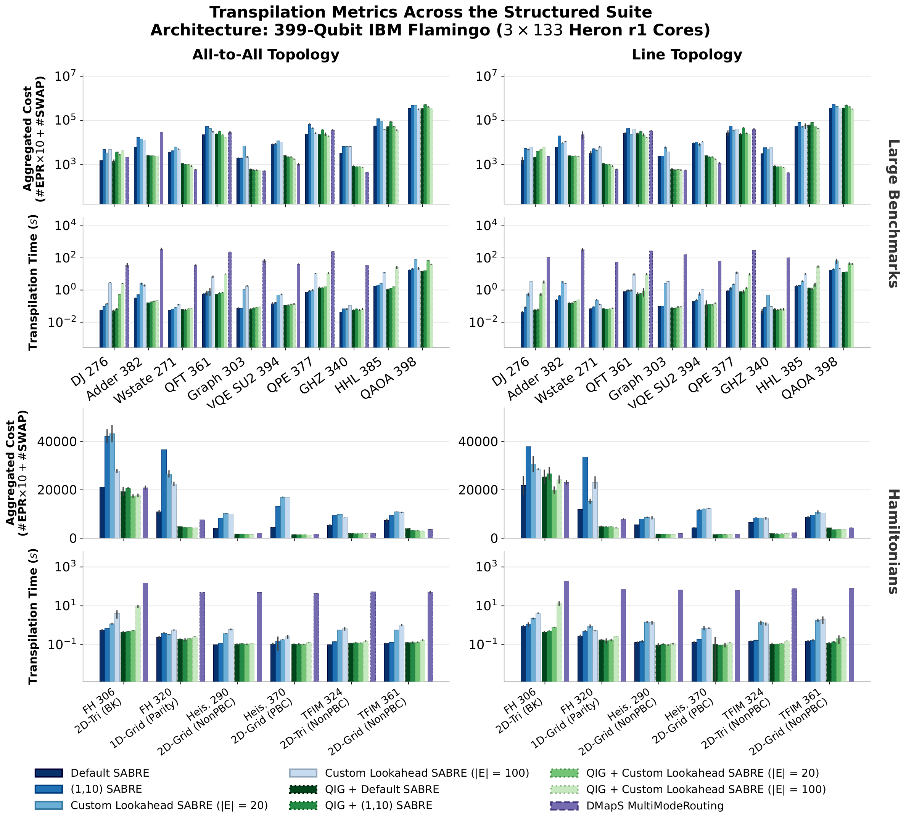

# Results

The full averaged results from the paper, transcribed from Tables II and III,
plus the circuit-level figures (Figs. 2 and 3). For the discussion around
these numbers, see Section VI of
[`Paper_draft_portrait.pdf`](../Paper_draft_portrait.pdf).

## How to read these numbers

**Aggregated cost** is the paper's single routing-quality metric (Eq. 1):

```
C_agg = (W_EPR x N_EPR) + N_local_SWAP,    W_EPR = 10
```

`N_EPR` is total EPR-pair consumption and `N_local_SWAP` the number of local
SWAPs inserted. The weight `W_EPR = 10` reflects the current order-of-magnitude
fidelity gap between remote and local operations, and is tunable as hardware
improves.

**Cost reduction** is `(1 - GM(C_method / C_baseline)) x 100%`, where `GM` is
the geometric mean over the relevant benchmark suite. **Speed-up** is
`GM(T_baseline / T_method)`. Negative cost reduction means *worse* than the
baseline. Note the two tables use **different baselines** — DMapS at 48 qubits,
and our own Default SABRE at 399 qubits, because DMapS and the hypergraph
methods largely time out at that scale.

Method abbreviations used in both tables:

| Short | Meaning |
| --- | --- |
| Def. SABRE | The DQC-adapted SABRE baseline (paper §IV-A) — conjoined coupling map plus modified layout selection, otherwise stock SABRE routing |
| (1,10) SABRE | Custom intra/inter-core distance weights (§IV-B) |
| CLA (\|E\|=n) | CLA-SABRE, Custom Lookahead SABRE (§IV-C), with lookahead window size `n` |
| CE | pytket-dqc's `CoverEmbedding` allocator |
| PH | pytket-dqc's `PartitioningHeterogeneous` allocator |
| HGP | (Hybrid) hypergraph partitioning — pytket-dqc allocator feeding CLA-SABRE (§V-B) |
| QIG | Quantum Interaction Graph partitioning (§V-C) |
| T.O. | Timed out |

Produced by the scripts in [`examples/`](../examples/) —
`three_square_architecture/` for Table II and Fig. 2, `flamingo_architecture/`
for Table III and Fig. 3. [`examples/README.md`](../examples/README.md) says
which script produces which rows.

## Table II — 48-qubit (3x16 square cores, all-to-all), relative to DMapS

Geometric-mean ratios. 1-hour timeout. **Bold** = best per column.

| Algorithm | Unstructured (7x5+1)<br>Cost Red. | Unstructured<br>Speed-up | Structured (20 circuits)<br>Cost Red. | Structured<br>Speed-up |
| :--- | ---: | ---: | ---: | ---: |
| **SABRE family** | | | | |
| Def. SABRE | −14.05% | **428.449x** | −17.87% | 328.991x |
| (1,10) SABRE | −0.54% | 393.313x | −68.18% | 296.675x |
| CLA (\|E\|=20) | 8.93% | 245.031x | −21.61% | 264.429x |
| CLA (\|E\|=100) | 7.54% | 125.559x | −36.53% | 74.640x |
| **Hypergraph family** | | | | |
| pytket (CE) + Def. SABRE | **33.05%** <sup>a</sup> | 0.428x <sup>a</sup> | T.O. <sup>b</sup> | T.O. <sup>b</sup> |
| pytket (PH) + Def. SABRE | 23.53% <sup>a</sup> | 0.256x <sup>a</sup> | T.O. <sup>b</sup> | T.O. <sup>b</sup> |
| HGP + CLA (\|E\|=20) | 26.70% | 24.348x | **28.94%** <sup>c</sup> | 19.152x <sup>c</sup> |
| **QIG family** | | | | |
| QIG + Def. SABRE | −8.90% | 281.934x | 16.87% | **403.934x** |
| QIG + (1,10) SABRE | 9.75% | 192.773x | 5.34% | 291.622x |
| QIG + CLA (\|E\|=20) | 24.72% | 139.597x | 24.01% | 252.574x |
| QIG + CLA (\|E\|=100) | 15.95% | 70.055x | 5.44% | 71.020x |

<sup>a</sup> Subset (35/36); 1-hour timeout on Quantum Volume (32 qubits).
<sup>b</sup> 1-hour timeout on 14/20 circuits; suite averages omitted as the
remaining sample is unrepresentative.
<sup>c</sup> Subset (19/20); 1-hour timeout on Shor's algorithm (42 qubits).

**The short version.** On unstructured circuits the hypergraph methods win on
quality (33.05% for pytket-dqc's `CoverEmbedding`) but run at *0.428x* DMapS's
speed — and then time out on 14 of 20 structured circuits. QIG + CLA-SABRE
(\|E\|=20) gets 24.72% of that reduction at **140x** DMapS's speed, and is the
only family that completes the structured suite, at 24.01% reduction and 253x.
The Hybrid (HGP + CLA-SABRE) sits between the two: 26.70% at 24x, roughly two
orders of magnitude faster than pure pytket-dqc.

Note also that a wider lookahead is not automatically better here: `|E|=100`
underperforms `|E|=20` at this scale, because distant gate dependencies start
to drown out immediately actionable teleportations. That inverts at 399 qubits.

## Table III — 399-qubit IBM Flamingo (3x133 Heron r1), relative to Def. SABRE

Geometric-mean ratios. 3-hour timeout. Hypergraph methods timed out on the
entire suite and are omitted. **Bold** = best per column.

| Algorithm | A2A Unstr.<br>Cost Red. | A2A Unstr.<br>Speed-up | A2A Struct.<br>Cost Red. | A2A Struct.<br>Speed-up | Line Unstr.<br>Cost Red. | Line Unstr.<br>Speed-up | Line Struct.<br>Cost Red. | Line Struct.<br>Speed-up |
| :--- | ---: | ---: | ---: | ---: | ---: | ---: | ---: | ---: |
| (1,10) SABRE | **10.30%** | 0.908x | −93.10% | 0.764x | 5.92% | 0.881x | −72.64% | 0.763x |
| CLA (\|E\|=20) | −127.79% | 0.095x | −106.95% | 0.350x | −261.50% | 0.032x | −43.47% | 0.184x |
| CLA (\|E\|=100) | −52.62% | 0.053x | −58.43% | 0.162x | −143.70% | 0.032x | −58.43% | 0.143x |
| QIG + Def. SABRE | 0.35% | **1.029x** | 46.99% | **1.051x** | 1.68% | **1.182x** | 48.41% | 1.264x |
| QIG + (1,10) SABRE | 10.07% | 0.899x | 40.33% | 0.977x | **7.21%** | 1.073x | 43.35% | **1.269x** |
| QIG + CLA (\|E\|=20) | −126.62% | 0.090x | 47.64% | 0.734x | −243.71% | 0.038x | 48.80% | 0.858x |
| QIG + CLA (\|E\|=100) | −52.62% | 0.053x | **51.94%** | 0.331x | −134.55% | 0.035x | **51.96%** | 0.373x |
| DMapS | T.O. | T.O. | 44.90% <sup>d</sup> | 0.002x <sup>d</sup> | T.O. | T.O. | 47.43% <sup>d</sup> | 0.002x <sup>d</sup> |

A2A = all-to-all inter-core topology; Line = restricted line topology.
Unstr. = unstructured suite (7x5+1 CZ-fraction circuits); Struct. = structured
suite (16 circuits).

<sup>d</sup> Subset (14/16); 3-hour timeout on the densest circuits (HHL-385,
QAOA-398).

**The short version.** At utility scale the partitioning step stops being
optional. Bare CLA-SABRE without QIG is *worse* than the Default SABRE baseline
across the board; paired with QIG partitioning it reaches **51.94%** (all-to-all)
and **51.96%** (line topology) cost reduction on the structured suite. The line
topology numbers track the all-to-all ones closely, which is the point of the
restricted-connectivity adaptation. DMapS completes only 14 of 16 structured
circuits, at 0.002x the speed — roughly 500x slower — and times out entirely on
the unstructured suite.

Here the wider lookahead pays off: `|E|=100` beats `|E|=20`, reversing the
48-qubit result.

## Figures

### Fig. 2 — 48-qubit architecture, circuit level



Left column: unstructured (CZ-fraction) circuits; right column: the "light"
structured suite. Rows: aggregated cost and total transpilation time (log
scale), under a 1-hour timeout. Bars are medians over 5 seeds; error bars show
the central 75% (12.5th–87.5th percentiles). Blues/greens are our methods
(SABRE and QIG variants), reds/oranges the hypergraph approaches, purple DMapS.

### Fig. 3 — 399-qubit IBM Flamingo, circuit level



The structured suite on the 399-qubit architecture, all-to-all (left) versus
line (right) inter-core topology, split into large benchmarks (top) and
Hamiltonian simulation circuits (bottom), under a 3-hour timeout. Missing bars
are timeouts: DMapS on the densest circuits (HHL-385, QAOA-398), and every
hypergraph approach across the whole suite. Color code matches Fig. 2.

Some circuits are omitted from both plots for visual clarity; every instance is
accounted for in the table averages above.
